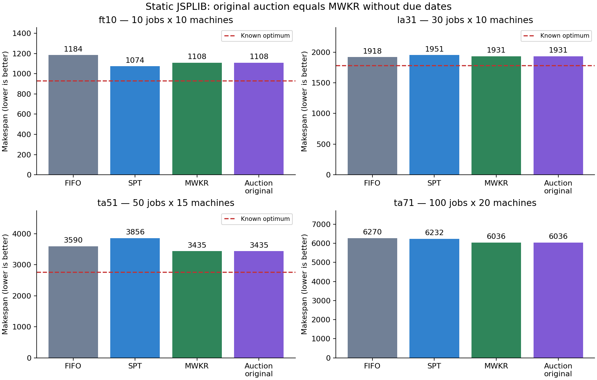

# Отчёт о текущем этапе бакалаврской работы

**Тема:** «Разработка и исследование мультиагентной системы с аукционным механизмом для динамического календарного планирования в задаче Job Shop Scheduling».

**Статус:** реализован прототип и проведено предварительное сравнительное исследование. Обучаемые агенты пока не реализованы.

## 1. Цель и постановка задачи

Цель работы — разработать систему распределения операций между ресурсами на основе взаимодействия агентов заказов и станков и исследовать качество получаемых расписаний в сравнении с правилами диспетчеризации.

В текущей модели каждый заказ состоит из последовательности операций. Для каждой операции заранее заданы станок и положительная длительность обработки. Одновременно на станке может выполняться только одна операция. Следующая операция заказа начинается после завершения предыдущей. Прерывание операций не допускается.

Рассматриваются статические партии заказов и конечные партии с поступлением заказов во времени. Для оценки соблюдения сроков вводятся синтетические дедлайны. Динамические отказы и восстановление станков пока не моделируются.

## 2. Реализованная система

Система написана на Python. Состояние производства и алгоритмы принятия решений разделены:

- **Environment** хранит время, заказы и станки, проверяет допустимость запуска и продвигает время к ближайшему событию.
- **JobAgent** представляет заказ и вычисляет ставку для доступной операции.
- **MachineAgent** выбирает максимальную ставку среди операций, претендующих на соответствующий станок.
- **ManagerAgent** организует раунды и передаёт выбранные назначения среде.
- **Модуль метрик и валидатор** оценивают расписание и проверяют ограничения.
- **Экспериментальный модуль** создаёт одинаковые сценарии для сравниваемых методов и сохраняет результаты.

Работа агентов выполняется в одном процессе под управлением менеджера. Распределённое исполнение и устойчивость к отказам управляющих узлов не исследовались.

Текущий механизм представляет собой однораундовый выбор по ставкам. Ставка является числовым приоритетом; цены, платежи и бюджеты отсутствуют. Следовательно, исследуется агентная схема диспетчеризации, а не полноценный экономический рынок ресурсов.

## 3. Выполненные изменения

1. **Унифицирован допуск операций.** Эвристики и агенты выбирают только операции, которые могут начаться в текущий момент. Среда запрещает запуск на занятом станке, повторное назначение и нарушение порядка операций.
2. **Исправлено управление временем.** Агенты больше не резервируют всё расписание при неизменном времени симуляции. Завершение симуляции соответствует фактическому завершению последних операций.
3. **Добавлено время поступления заказа release_time.** До этого момента заказ не участвует в выборе.
4. **Выделен общий модуль приоритетов.** Одинаковые формулы доступны централизованным алгоритмам и агентам.
5. **Исправлена трактовка FIFO.** Учитывается время входа в очередь станка, а не номер заказа.
6. **Исправлен расчёт загрузки станков.** Используется сумма фактических интервалов обработки.
7. **Усилена валидация.** Проверяются наличие всех интервалов, длительности, порядок операций, время поступления и отсутствие пересечений на станках.
8. **Добавлен воспроизводимый эксперимент.** Зафиксированы версия данных, контрольные суммы, параметры и хеши исходного кода.

В последнем выполненном запуске набора автоматических тестов прошли **23 теста**. Все **1134 расписания** массового эксперимента прошли реализованные проверки. Эти проверки не являются доказательством оптимальности расписаний или отсутствия любых возможных ошибок.

## 4. Исследованные методы

Обозначения: t — текущее время; d — срок завершения заказа; p — длительность текущей операции; R — суммарная длительность текущей и последующих операций заказа.

| Метод | Принцип выбора |
|---|---|
| FIFO | Ранее поступившая в очередь операция |
| EDD | Заказ с ближайшим сроком |
| SPT | Операция с минимальной длительностью p |
| MWKR | Заказ с максимальной оставшейся обработкой R |
| CR | Минимальное отношение (d − t) / R |
| ATC_LOCAL | Комбинация длительности текущей операции и запаса до срока |
| CENTRAL_ORIGINAL | Исходная формула приоритета через централизованный выбор |
| AUCTION_ORIGINAL | Исходная формула приоритета через агентов |
| AUCTION_ATC | Формула ATC_LOCAL через агентов |

Исходная ставка:

**bid = R + 100 / max(d − t, 10⁻⁶).**

При отсутствии дедлайна второе слагаемое равно нулю. В этом случае правило совпадает с MWKR.

В ATC_LOCAL используется индекс:

**I = exp(−max(d − t − R, 0) / (k × p_mean)) / p.**

Здесь p_mean — средняя длительность доступных операций на соответствующем станке; k = 2. Веса заказов равны единице. Для вычислений используется логарифм индекса, сохраняющий порядок приоритетов.

ATC_LOCAL является явно определённой адаптацией ATC: из срока заказа вычитается последующая обработка, но не оценивается ожидание в будущих очередях. Полное воспроизведение методов исходной статьи Vepsalainen и Morton не заявляется. Без дедлайнов ATC_LOCAL сводится к SPT.

## 5. Методика эксперимента

Использованы девять экземпляров JSPLIB: FT06, FT10, FT20, LA01, LA16, LA31, ABZ5, TA51, TA71. Размеры — от 6 заказов и 6 станков до 100 заказов и 20 станков, то есть до 2000 операций.

Для каждого экземпляра сформированы:

- **1 статический сценарий:** все заказы доступны с начала, дедлайнов нет.
- **3 сценария со сроками:** все заказы доступны с начала; коэффициент срока равен 1,5, 2 или 3.
- **10 сценариев с поступлениями:** два коэффициента срока — 1,5 и 2; пять seed — от 0 до 4.

Итого: **9 экземпляров × 14 сценариев × 9 методов = 1134 прогона**.

Дедлайн определяется как:

**d = release_time + коэффициент срока × суммарная обработка заказа.**

Для сценариев поступления release_time генерируется равномерно на интервале от 0 до отношения общей обработки всех заказов к числу станков.

Сроки и поступления добавлены в рамках данного проекта и не входят в исходные статические экземпляры JSPLIB. Модель представляет конечную партию, а не стационарный поток производственных заказов.

Все методы в одной группе получают одинаковые исходные условия. Методы детерминированы; seed изменяет только сценарий поступления.

Измеряются makespan, суммарное опоздание, доля просроченных заказов, среднее время пребывания заказа, загрузка станков и время расчёта. Для агентных методов дополнительно считаются заявки и аукционы.

## 6. Результаты по makespan

Makespan — момент завершения последнего заказа. Меньшее значение соответствует более раннему завершению партии.

| Экземпляр | Размер | Оптимум в метаданных | FIFO | SPT | MWKR / исходный аукцион |
|---|---|---:|---:|---:|---:|
| FT06 | 6 × 6 | 55 | 65 | 88 | 61 |
| FT10 | 10 × 10 | 930 | 1184 | 1074 | 1108 |
| FT20 | 20 × 5 | 1165 | 1645 | 1267 | 1501 |
| LA01 | 10 × 5 | 666 | 772 | 751 | 735 |
| LA16 | 10 × 10 | 945 | 1180 | 1156 | 1054 |
| LA31 | 30 × 10 | 1784 | 1918 | 1951 | 1931 |
| ABZ5 | 10 × 10 | 1234 | 1467 | 1352 | 1369 |
| TA51 | 50 × 15 | 2760 | 3590 | 3856 | 3435 |
| TA71 | 100 × 20 | Не указан | 6270 | 6232 | 6036 |

Среди всех девяти проверенных методов:

- исходный аукцион разделил лучший результат с MWKR и CENTRAL_ORIGINAL на **5 из 9 экземпляров**;
- SPT, ATC_LOCAL и AUCTION_ATC разделили лучший результат на **3 экземплярах**;
- FIFO оказался лучшим на **1 экземпляре**.

На TA71 исходный аукцион получил makespan 6036 против 6270 у FIFO — уменьшение примерно на 3,73%.

Однако исходный аукцион совпадает с MWKR на всех статических задачах без дедлайнов. Поэтому эти результаты характеризуют эффективность выбранной формулы приоритета, а не доказывают самостоятельное преимущество агентного механизма.

Лучший результат среди исследованных эвристик не означает оптимум. Например, на FT10 исходный аукцион получил 1108 при известном оптимуме 930: отклонение составляет около 19,14%.



## 7. Результаты по соблюдению сроков

Суммарное опоздание рассчитывается как сумма max(0, C_j − d_j), где C_j — завершение заказа. Досрочное выполнение одного заказа не компенсирует опоздание другого.

В таблице представлено среднее парных относительных изменений суммарного опоздания относительно FIFO. Отрицательное значение означает улучшение.

| Метод | Одновременная доступность, сроки заданы | Поступления во времени |
|---|---:|---:|
| EDD | −58,66% | −37,36% |
| SPT | −45,47% | −31,66% |
| MWKR | +17,91% | +89,56% |
| CR | −42,56% | −30,79% |
| ATC_LOCAL / AUCTION_ATC | −60,17% | −48,33% |
| CENTRAL_ORIGINAL / AUCTION_ORIGINAL | +10,85% | +43,41% |

Для каждого сценария сначала рассчитывается 100 × (T_метода / T_FIFO − 1), затем усредняются полученные значения. Это не отношение суммарных опозданий, сложенных по всем сценариям.

Из процентного расчёта исключены случаи T_FIFO = 0: использованы 21 из 27 сценариев со сроками и 74 из 90 сценариев с поступлениями. Абсолютные значения исключённых случаев сохранены в runs.csv.

На проведённых сценариях ATC_LOCAL показал меньшее среднее относительное опоздание, чем остальные проверенные формулы. Исходная ставка, напротив, в среднем ухудшила этот показатель относительно FIFO.

Результат предварительный: использованы синтетические условия, пять seed поступлений и описательная статистика. Доверительные интервалы и проверка статистической значимости пока не рассчитаны.

## 8. Основные выводы текущего этапа

1. Создан работающий прототип с единой событийной моделью и возможностью сравнения политик на одинаковых данных.
2. Исходная ставка конкурентоспособна по makespan на части статических задач, но не обеспечивает наилучшее соблюдение сроков.
3. Приоритет ATC_LOCAL перспективен для последующего исследования сценариев с дедлайнами.
4. При одинаковых формулах и правилах разрешения равенств агентный и централизованный варианты дали одинаковые расписания во всех проверках.
5. Самостоятельное преимущество аукционного взаимодействия пока не установлено. Для его исследования требуется содержательно развивать поведение агентов либо протокол координации.
6. Обучение агентов не проводилось. Результаты относятся к фиксированным правилам.

## 9. Предлагаемый следующий этап

Предлагается исследовать адаптивный выбор стратегии агентом станка. Перед аукционом агент получает признаки текущей очереди и выбирает правило из SPT, EDD, MWKR и ATC_LOCAL. Агенты заказов рассчитывают ставки по выбранному правилу, после чего выполняется обычный выбор победителя.

**Исследовательский вопрос:** позволяет ли обучаемый выбор стратегии уменьшить суммарное опоздание по сравнению с постоянным использованием ATC_LOCAL?

Для проверки потребуются:

- признаки состояния и интерфейс политики агента;
- алгоритм обучения с явно заданной целевой функцией;
- раздельные учебные, валидационные и тестовые сценарии;
- сравнение с фиксированным ATC_LOCAL и другими эвристиками;
- оценка устойчивости на нескольких независимых запусках обучения;
- анализ чувствительности к срокам, поступлениям и параметру k.

Более глубокий вариант — обучение самих ставок агентов заказов. Он требует дополнительного определения целей агентов и механизма согласования локальных решений.

Предлагаемый следующий этап ещё не реализован. Поломки и восстановление станков также остаются отдельным расширением.

## 10. Вопросы для обсуждения с научным руководителем

1. Какой показатель считать основным: makespan или суммарное опоздание?
2. Достаточно ли поступления новых заказов как динамического фактора, или необходимо добавить отказы станков?
3. Что выбрать основным направлением развития: обучаемый выбор правила, обучаемые ставки или более содержательный аукционный протокол?
4. Какой объём экспериментов и статистического анализа необходим для итоговой работы?

## 11. Источники

1. Panwalkar S. S., Iskander W. **A Survey of Scheduling Rules.** Operations Research, 1977, 25(1), 45–61. [DOI](https://doi.org/10.1287/opre.25.1.45).
2. Vepsalainen A. P. J., Morton T. E. **Priority Rules for Job Shops with Weighted Tardiness Costs.** Management Science, 1987, 33(8), 1035–1047. [DOI](https://doi.org/10.1287/mnsc.33.8.1035).
3. Lamothe J., Marmier F., Dupuy M., Gaborit P., Dupont L. **Scheduling rules to minimize total tardiness in a parallel machine problem with setup and calendar constraints.** Computers & Operations Research, 2012, 39(6), 1236–1244. [DOI](https://doi.org/10.1016/j.cor.2010.07.007), [открытый текст](https://arxiv.org/abs/1509.02099). Использована базовая формула ATC; модель статьи целиком не воспроизводилась.
4. Wellman M. P., Walsh W. E., Wurman P. R., MacKie-Mason J. K. **Auction Protocols for Decentralized Scheduling.** Games and Economic Behavior, 2001, 35, 271–303. [DOI](https://doi.org/10.1006/game.2000.0822). Теоретическая основа; протокол статьи не реализован.
5. Liu R., Piplani R., Toro C. **A deep multi-agent reinforcement learning approach to solve dynamic job shop scheduling problem.** Computers & Operations Research, 2023, 159, 106294. [DOI](https://doi.org/10.1016/j.cor.2023.106294). Источник для планирования следующего этапа, не реализованный метод.
6. [JSPLIB — источник бенчмарков](https://github.com/tamy0612/JSPLIB). Использована версия eea2b60dd7e2f5c907ff7302662c61812eb7efdf.

## 12. Материалы и воспроизведение

- Подробности методов: docs/methods_and_sources.md.
- Полные результаты: results/benchmark/runs.csv.
- Сводный отчёт: results/benchmark/report.md.
- Параметры и хеши кода: results/benchmark/config.json.
- Версия и контрольные суммы данных: data/benchmarks/manifest.json.

Из корня проекта после установки зависимостей:

```powershell
python -m pytest
python run_experiment.py data/benchmarks/ft10.txt --scenario arrivals --due-factor 2 --seed 0
python scripts/run_benchmarks.py --seeds 5 --output results/repeat_check
python scripts/plot_benchmarks.py --results results/repeat_check
```

Для повторения сохранённых результатов необходима та же версия кода и данных. Новая папка вывода позволяет сохранить исходный эксперимент.

## Короткое сообщение для встречи

«На текущем этапе реализован прототип системы с агентами заказов и станков и однораундовым выбором операций по ставкам. Исправлена событийная модель, добавлено поступление заказов во времени и подготовлен стенд сравнения с известными правилами диспетчеризации.

Проведено 1134 прогона на девяти бенчмарках, максимальный размер — 2000 операций. Все расписания прошли реализованные проверки. По makespan исходный аукцион разделил лучший результат с MWKR на пяти из девяти статических задач. При одинаковой формуле агентная и централизованная реализации дают одинаковое расписание, поэтому самостоятельное преимущество аукциона пока не установлено.

Для соблюдения сроков лучше проявила себя адаптация ATC. В сценариях с поступлениями среднее парное относительное изменение опоздания составило минус 48,33% к FIFO по случаям с ненулевым опозданием FIFO. Статистическая значимость пока не проверена.

Следующим этапом предлагаю исследовать обучаемый выбор стратегии агентом станка и сравнить его с постоянным ATC. Хотелось бы согласовать основной критерий качества и необходимость включения поломок станков».
